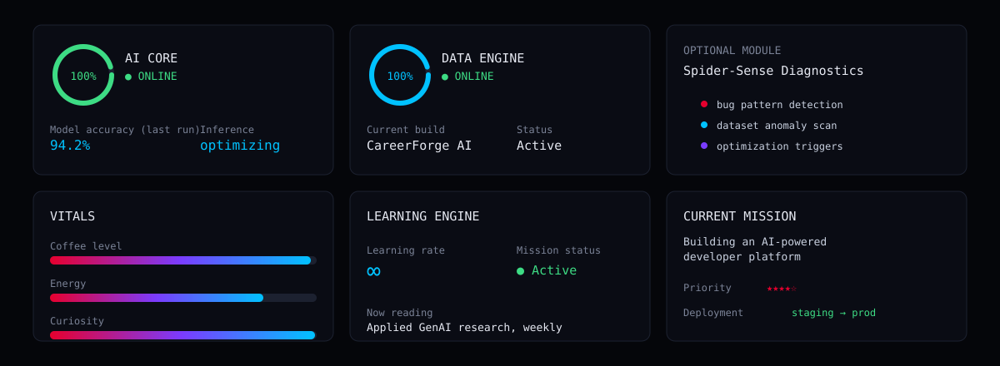

<div align="center">



<br/>


<br/>


</div>

# `Developer.OS`

```text
> boot Developer.OS

Initializing neural systems ............ OK
Loading ML / AI engine .................. OK
Loading data science engine ............. OK
Loading data analytics engine ........... OK
Loading full-stack environment .......... OK
Connecting imagination to execution ..... OK

SYSTEM READY.
```

---

## `> whoami`

```text
NAME            Jasmanjot Singh Sarna
ROLE            AI Full-Stack Developer @ Lavelda Coffee Beans LLP
LEADERSHIP      Head of Incoming Social Sector, AIESEC Jaipur
BUILDING        CareerForge OS (co-founder)
EDUCATION       B.Tech CS (AI & ML), JECRC University — Class of 2027
```

```text
FOUR DISCIPLINES. ONE STACK.
━━━━━━━━━━━━━━━━━━━━━━━━━━━━━━━━━━━━━━━━

🧠 AI / ML ENGINEER     → models, LLMs, computer vision, RAG systems
💻 FULL-STACK DEVELOPER → production apps, APIs, real infrastructure
📊 DATA SCIENTIST       → cleaning, features, training, evaluation
📈 DATA ANALYST         → SQL, dashboards, insight, decisions

Mindset      Engineer · Builder · Analyst · Problem Solver
Trajectory   Engineer → Builder → AI Product Developer → Founder
Status       Building. Learning. Shipping.
━━━━━━━━━━━━━━━━━━━━━━━━━━━━━━━━━━━━━━━━
```

> **I don't just build models. I build the systems, the data pipelines, and the products around them.**

---


## `> system.dashboard`

<div align="center">



</div>

<details>
<summary><b>Dashboard as text</b></summary>

```text
AI / ML ENGINE ................ ONLINE
DATA SCIENCE ENGINE ........... ONLINE
DATA ANALYTICS ENGINE ......... ONLINE
FULL-STACK ENGINE ............. ONLINE
VISION MODULE .................. ONLINE
API / RAG SYSTEM .............. ONLINE
DEPLOYMENT PIPELINE ........... ACTIVE

CURIOSITY ....................... 99%
LEARNING RATE ................... ∞
BUILD MODE ...................... ACTIVE

CURRENT OBJECTIVE:
Build intelligent, data-grounded products that ship.
```

</details>

---


## `> capabilities`

### 🧠 AI / ML ENGINEERING

```text
Machine Learning · Deep Learning · Generative AI
Large Language Models · Computer Vision · NLP
RAG Pipelines (LangChain, FAISS, Pinecone)
Prompt Engineering · Model Evaluation
```

### 💻 FULL-STACK DEVELOPMENT

```text
Frontend    React · Next.js · Vue 3 / Pinia · TypeScript
Backend     Python · NestJS · REST APIs · Server Architecture
Data Layer  PostgreSQL · Prisma · Redis
Infra       Docker · Neon · Upstash · Git · Vercel
```

### 📊 DATA SCIENCE

```text
Python · NumPy · Pandas · Scikit-learn
K-Means Clustering · RFM Segmentation
TensorFlow · PyTorch · OpenCV
Feature Engineering · Model Training & Evaluation
```

### 📈 DATA ANALYTICS

```text
SQL · Pandas · Excel · Power BI · Tableau
Data Visualization · Exploratory Data Analysis
Dashboard Development · Business Insight Generation
```

---

## `> tech.stack`

<div align="center">

**Languages**


**AI / ML**


**Full Stack**


**Data & Infra**


**Tools / Cloud**


</div>

---


## `> architecture`

<div align="center">

```text
                     ┌─────────────────────┐
                     │       PROBLEM       │
                     └──────────┬──────────┘
                                ↓
          ┌─────────────────────────────────────────┐
          │              DATA LAYER                  │
          │   Collect · Clean · Analyze · Engineer   │
          └──────────────────────┬────────────────────┘
                                 ↓
          ┌─────────────────────────────────────────┐
          │            AI / ML LAYER                  │
          │  Train · Evaluate · Predict · Generate    │
          │      Models · LLMs · Computer Vision      │
          └──────────────────────┬────────────────────┘
                                 ↓
          ┌─────────────────────────────────────────┐
          │             APPLICATION                   │
          │     Frontend ←→ Backend ←→ APIs           │
          └──────────────────────┬────────────────────┘
                                 ↓
                     ┌─────────────────────┐
                     │     DEPLOYMENT      │
                     │ Cloud · Docker · CI │
                     └──────────┬──────────┘
                                ↓
                     ┌─────────────────────┐
                     │       PRODUCT       │
                     └─────────────────────┘
```

</div>

> **One engineer. Four disciplines. One complete system.**

---


## `> mission.control`

### `MC-001 · CareerForge OS`

<details open>
<summary><b>AI-Powered Career Intelligence Platform</b> · Priority: HIGH · Status: ACTIVE</summary>

```text
OBJECTIVE
Turn raw experience into a targeted, ATS-ready career strategy.

CORE SYSTEMS
9-stage Career Journey™ state machine
Career Score™ engine
Resume Suite — two-tier ATS scoring
Interview Suite — adaptive question generation
Auth with refresh-token rotation

STACK
Next.js · NestJS · PostgreSQL/Prisma · Redis

PROGRESS
████████░░ 80%

STATUS
Staging → Production

NEXT
Docker → Neon/Upstash infra migration
```

</details>

---

### `MC-002 · RazorGrowth AI`

<details>
<summary><b>AI-Powered Merchant Analytics</b> · Priority: MEDIUM · Status: ACTIVE</summary>

```text
OBJECTIVE
Turn raw transaction data into merchant growth signals.

CORE SYSTEMS
RFM segmentation
K-Means clustering pipeline

STACK
Python · Pandas · Scikit-learn

STATUS
Building
```

</details>

---

### `MC-003 · Trading Dashboard`

<details>
<summary><b>Real-Time Market Intelligence Dashboard</b> · Priority: MEDIUM · Status: COMPLETE</summary>

```text
OBJECTIVE
Convert real-time market data into decision-ready insights.

STACK
Python · Pandas · APIs · Data Visualization

PROGRESS
██████████ 100%

STATUS
Production
```

</details>

---

### `MC-004 · Face Emotion Recognition`

<details>
<summary><b>Computer Vision Emotion Classifier</b> · Priority: MEDIUM · Status: COMPLETE</summary>

```text
OBJECTIVE
Classify human emotions from facial expressions in real time.

STACK
Python · OpenCV · CNNs · TensorFlow

PROGRESS
██████████ 100%

STATUS
Complete
```

</details>

---

### `MC-005 · Air Canvas`

<details>
<summary><b>Touchless AI Drawing System</b> · Priority: LOW · Status: COMPLETE</summary>

```text
OBJECTIVE
Draw in the air using nothing but hand tracking.

STACK
Python · OpenCV · MediaPipe

PROGRESS
██████████ 100%

STATUS
Complete
```

</details>

---


## `> currently.building`

```text
┌─────────────────────────────────────────────────┐
│                CURRENT MISSION                  │
├─────────────────────────────────────────────────┤
│  → Shipping CareerForge OS to production        │
│  → Strengthening RAG & LLM system design        │
│  → Sharpening data science + analytics fluency  │
│  → Leading Incoming Social Sector @ AIESEC      │
│  → Turning data into intelligent decisions      │
└─────────────────────────────────────────────────┘
```

### Long-Term Mission

> **Build AI systems useful enough to become products — and a company around them.**

---


## `> engineering.journey`

```text
PROGRAMMING → DATA ANALYTICS → DATA SCIENCE → MACHINE LEARNING
    → DEEP LEARNING → GENERATIVE AI → FULL-STACK ENGINEERING
        → AI ENGINEERING → END-TO-END PRODUCTS → ENTREPRENEURSHIP
```

---


## `> operating.principles`

```text
BUILD        >  CONSUME
SHIP         >  PERFECT
UNDERSTAND   >  MEMORIZE
SYSTEMS      >  SHORTCUTS
DEPTH + BREADTH > LIMITING YOURSELF

IDEA → PROTOTYPE → PRODUCT → IMPACT
```

---


## `> system.analytics`

<div align="center">

### `GITHUB ACTIVITY`


<br/><br/>


</div>

<br/>

```text
┌──────────────────────────────────────────────────────────────┐
│                     DEVELOPER.OS / ANALYTICS                 │
├──────────────────────────────────────────────────────────────┤
│                                                              │
│  CONTRIBUTION ENGINE ............. LIVE                      │
│  COMMIT ACTIVITY ................ TRACKED                    │
│  DEVELOPMENT STREAK ............. TRACKED                    │
│  REPOSITORY ACTIVITY ............ ACTIVE                     │
│                                                              │
│  BUILD FREQUENCY ................ INCREASING                 │
│  SHIPPING STATUS ................ ACTIVE                     │
│  SYSTEM STATE ................... BUILDING                   │
│                                                              │
└──────────────────────────────────────────────────────────────┘
```

> **Code is the output. Consistency is the engine.**

---


---


## `> console`

```text
> help

AVAILABLE COMMANDS

whoami       → display identity
skills       → display capabilities
projects     → display mission projects
stack        → display technology stack
journey      → display engineering journey
future       → display long-term mission
coffee       → check system fuel
unlock       → access hidden layer
```

```text
> future

Building AI systems.
Building products.
Building the skills to build a company.

One shipped project at a time.
```

```text
> coffee

CRITICAL.
Always.
```

```text
> unlock

01010111 01100101 01101100 01100011 01101111 01101101 01100101

Hidden layer detected.
Welcome, developer.
```

---


## `> transmission.contact`

<div align="center">

[](https://github.com/JasmanjotSarna)
[](https://www.linkedin.com/in/jasmanjot-singh-sarna-0a2539286/)
[](https://jasmanjot-portfolio.vercel.app/)
[](mailto:jasmanjotsinghsarna@gmail.com)

</div>

---

<div align="center">

```text
SYSTEM STATUS
━━━━━━━━━━━━━━━━━━━━━━━━━━━━━━

AI / ML ENGINE ......... OPERATIONAL
DATA SCIENCE ENGINE ..... OPERATIONAL
DATA ANALYTICS ENGINE ... OPERATIONAL
FULL-STACK ENGINE ....... OPERATIONAL
BUILD ENGINE ............ ACTIVE
FOUNDER MODE ............. INITIALIZING

━━━━━━━━━━━━━━━━━━━━━━━━━━━━━━

> No finish line detected.
```

<br/>

<sub>See you in the next commit.</sub>

</div>
