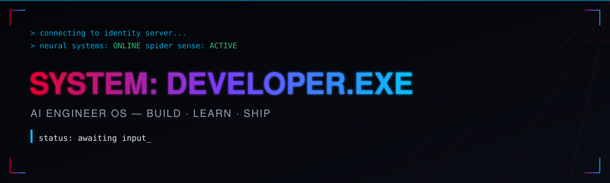

<div align="center">

</div>

<pre align="center">
BOOT SEQUENCE
━━━━━━━━━━━━━━━━━━━━━━━━━━━━━━━━━━━━
[■■■■■■■■■■■■■■■■■■■■] 100%
Connecting..................... OK
Neural Network.................. OK
Spider Sense..................... ACTIVE
Identity......................... VERIFIED
Mission.......................... LOADED
━━━━━━━━━━━━━━━━━━━━━━━━━━━━━━━━━━━━
SYSTEM READY.
</pre>

<div align="center">

</div>


## 🪪 Identity Verification

```
USER   > Who is this?
SYSTEM > Analyzing...

  Identity Confirmed.
  ─────────────────────────
  Role         AI Engineer / Builder
  Class        Data Enthusiast, Startup Founder (in progress)
  Curiosity    ████████████████████ 99%
  Coffee Dep.  ████████████████████ Critical
  Learning     ░░░░░░░░░░░░░░░░░░░░ Never Complete
  ─────────────────────────
```


## 📊 Mission Dashboard

<table>
<tr><td>

```
CURRENT MISSION
Building an AI-powered
developer platform

CURRENT EXPERIMENT
Multi-agent LLM workflows

CURRENT BUILD
CareerForge AI v2
```

</td><td>

```
LEVEL         14
XP            ████████░░  82%
DIFFICULTY    ★★★★☆
ENERGY        ████████░░  80%
COFFEE LEVEL  ██████████ 100%
STATUS        ACTIVE
```

</td></tr>
</table>


## 🕷 Spider Sense — Live Diagnostics

<div align="center">

</div>

```
THREAT DETECTION ........ scanning for anti-patterns
BUG DETECTION ............ tingling near untested code paths
PATTERN RECOGNITION ...... locked onto dataset anomalies
AI DISCOVERY .............. new paper flagged, reading now
OPTIMIZATION .............. one line, three hours, no regrets
```


## 🎯 Current Quest

```
┌─────────────────────────────────────────────┐
│  QUEST: Land an AI Engineer Role             │
│  Difficulty: ★★★★★                          │
│  Rewards: Knowledge · Experience · Impact     │
├─────────────────────────────────────────────┤
│  NEXT QUEST                                  │
│  Scale CareerForge AI to real users          │
├─────────────────────────────────────────────┤
│  FUTURE QUEST                                │
│  Build an AI startup used by millions        │
└─────────────────────────────────────────────┘
```


## 🕸 Tech Arsenal

<table>
<tr><th>Primary Weapons</th><th>Secondary Weapons</th><th>AI Modules</th></tr>
<tr>
<td>Python<br/>SQL</td>
<td>TypeScript<br/>JavaScript<br/>C++</td>
<td>PyTorch · TensorFlow<br/>Computer Vision<br/>Hugging Face</td>
</tr>
<tr><th>Data Engine</th><th>Deployment Rig</th><th>Field Tools</th></tr>
<tr>
<td>Pandas · NumPy<br/>Power BI · Tableau</td>
<td>Docker · AWS<br/>Vercel · Azure</td>
<td>Git · Linux<br/>VS Code · Postman</td>
</tr>
</table>


## 🧪 AI Laboratory

```
LAB STATUS ................. OPERATIONAL
EXPERIMENTS RUNNING ......... 3
MODELS TRAINING ............. 1
INFERENCE SPEED ............. optimizing
MODEL ACCURACY (last run) ... 94.2%
LATEST RESEARCH FLAGGED ..... applied GenAI, agentic workflows
CURRENT EXPERIMENT ........... prompt-driven automation pipeline
STATUS ........................ IN PROGRESS
```


## 🔍 Data Detective

<details open>
<summary><b>CASE #1048 — The Missing Pattern</b></summary>

```
STATUS ............. SOLVED
EVIDENCE ........... raw, inconsistent transactional data
MODELS USED ......... clustering + anomaly detection
VISUALIZATION ....... interactive dashboard
DECISION ............ flagged 3 previously invisible fraud patterns
```
</details>


## 🧭 Knowledge Timeline

```
Beginning
   │
   ▼
Programming
   │
   ▼
Data
   │
   ▼
Machine Learning
   │
   ▼
Artificial Intelligence
   │
   ▼
Building Products
   │
   ▼
Entrepreneurship
   │
   ▼
Future ⚡
```


## 📖 Project Missions

<details open>
<summary><b>MISSION 001 — CareerForge AI</b></summary>
<br/>

| | |
|---|---|
| **Objective** | Turn raw experience into a targeted, compelling job application |
| **Challenge** | Generic resume advice ignores role-specific context |
| **Solution** | LLM-driven, role-aware resume & career guidance |
| **Technology** | Python · LLMs · Prompt Engineering · React |
| **Status** | 🟢 Active |
| **Completion** | ████████░░ 80% |
| **Next Upgrade** | Multi-language support |
| **Difficulty** | ★★★★☆ |

</details>

<details>
<summary><b>MISSION 002 — Trading Dashboard</b></summary>
<br/>

| | |
|---|---|
| **Objective** | Turn raw market data into a decision-ready live view |
| **Challenge** | Real-time data is noisy and inconsistent |
| **Solution** | Streaming pipeline + clean real-time visualization |
| **Technology** | Python · Pandas · APIs · Data Viz |
| **Status** | 🟡 Maintained |
| **Completion** | ██████████ 100% |
| **Next Upgrade** | Predictive alerts |
| **Difficulty** | ★★★☆☆ |

</details>

<details>
<summary><b>MISSION 003 — Face Emotion Recognition</b></summary>
<br/>

| | |
|---|---|
| **Objective** | Detect human emotion from facial expressions in real time |
| **Challenge** | Lighting, angle, and expression variance |
| **Solution** | CNN-based real-time classification pipeline |
| **Technology** | Python · OpenCV · CNNs · TensorFlow |
| **Status** | ✅ Complete |
| **Completion** | ██████████ 100% |
| **Next Upgrade** | Edge-device deployment |
| **Difficulty** | ★★★★☆ |

</details>

<details>
<summary><b>MISSION 004 — Air Canvas</b></summary>
<br/>

| | |
|---|---|
| **Objective** | Draw in the air using hand-tracking, no stylus needed |
| **Challenge** | Tracking fingertip motion accurately in real time |
| **Solution** | Gesture-based, touchless drawing tool |
| **Technology** | Python · OpenCV · MediaPipe |
| **Status** | ✅ Complete |
| **Completion** | ██████████ 100% |
| **Next Upgrade** | Multi-hand gesture support |
| **Difficulty** | ★★★☆☆ |

</details>


## 📡 System Analytics

<div align="center">


</div>

<div align="center">

</div>

<div align="center">

</div>


## 🏆 Achievements

```
[✔] First AI Model Shipped
[✔] Open Source Contributor
[✔] Hackathon Survivor
[✔] 1000+ Commits
[✔] CareerForge AI Launched
[ ] AI Startup — LOADING...
```


<details>
<summary>🔐 <b>Secret Terminal</b> — click if you're curious</summary>
<br/>

```
> whoami
an engineer who reads changelogs for fun

> sudo unlock --easter-egg
Access granted.
01001000 01101001 00100000 01110100 01101000 01100101 01110010 01100101
(translation: hi there — you found the hidden layer. bonus points if
 you actually decoded that instead of trusting this comment.)

> cat next_steps.txt
if you're a recruiter: scroll to the contact terminal below.
if you're a fellow builder: my repos are open, dig around.
```
</details>


## 📟 Communication Terminal

<div align="center">

```
TRANSMISSION CHANNELS
─────────────────────────
```

[](#)
[](#)
[](#)
[](#)
[](#)

</div>


<div align="center">

```
MISSION STATUS
━━━━━━━━━━━━━━━━━━━━━━━━━━━
LEARNING ........... ACTIVE
BUILDING ............ ACTIVE
INNOVATION .......... ACTIVE
SPIDER SENSE ........ ENABLED
AI SYSTEMS .......... ONLINE
FUTURE STARTUP ...... LOADING...
━━━━━━━━━━━━━━━━━━━━━━━━━━━
TRANSMISSION COMPLETE.
```

<sub>Thanks for scrolling this far. That's already more curiosity than most — you'll fit right in around here.</sub>

</div>
